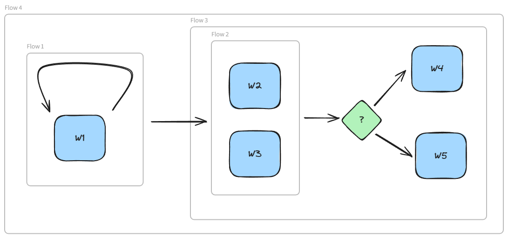

# ez-flow

[](https://www.npmjs.com/package/@rs-box/ez-flow)
[](https://github.com/rstanziale/ez-flow/actions)


It's a library implementing a simple workflow engine.

This library was heavily inspired to [j-easy/easy-flows](https://github.com/j-easy/easy-flows) in the Java world.

## Installation

```bash
npm install @rs-box/ez-flow
```

## Usage

A **Workflow** is a collection of **Work Units** must be run tu achieve a given purpose.

Each _Work_ unit implements a behaviour and interacts with outer environment and the other units by the means of a **Context** exchanged between them. You can place each unit in a flow applying some logic to control it.

That is you can place unit in a sequential flow, in a conditional one, in a parallel one and so on.

At the end of this "chain" we obtain the final result.

In this library are actually available the following flow constructs:

- **Sequential Flow**
- **Conditional Flow**
- **Iterative Flow**
- **Parallel Flow**


### How to apply a flow?

Suppose you have defined a work unit called **PrintMessageWork** that implements _Work_. It takes a _message_ and its _call_ method prints it:<br/>

```typescript
import {
  Work,
  WorkContext,
  WorkReport,
  DefaultWorkReport,
  WorkStatus,
} from '@rs-box/ez-flow';

export class PrintMessageWork implements Work {
  private message: string;

  constructor(message: string) {
    this.message = message;
  }

  getName() {
    return 'print message';
  }

  async call(workContext: WorkContext): Promise<WorkReport> {
    console.log(this.message);
    return new DefaultWorkReport(WorkStatus.COMPLETED, workContext);
  }
}
```

Now suppose to create the following workflow:

- Print "foo" 3 times
- Then print "hello" and "world" in parallel
- Then if both "hello" and "world" have been successfully printed, finally print "ok", otherwise print "nok".

This workflow can be illustrated as follows:



- _flow1_ is a **RepeatFlow** of _work1_ which prints "foo" 3 times.
- _flow2_ is a **ParallelFlow** of _work2_ and _work3_ which prints "hello" and "world" in parallel
- _flow3_ is a **ConditionalFlow**. It first executes _flow2_, then if _flow2_ is completed, it executes _work4_ (print "ok"), otherwise executes _work5_ (print "nok")
- _flow4_ is a **SequentialFlow**. It executes _flow1_ then _flow3_ in sequence

This is a code snippet for the above example:

```typescript
import {
  ConditionalFlow,
  SequentialFlow,
  RepeatFlow,
  ParallelFlow,
  WorkFlowEngine,
  WorkStatus,
  WorkContext,
  WorkFlowEngineBuilder,
  WorkReport,
} from '@rs-box/ez-flow';
import { PrintMessageWork } from './print-message-work.ts';

// 1. Build work units
const work1: PrintMessageWork = new PrintMessageWork('foo');
const work2: PrintMessageWork = new PrintMessageWork('hello');
const work3: PrintMessageWork = new PrintMessageWork('world');
const work4: PrintMessageWork = new PrintMessageWork('ok');
const work5: PrintMessageWork = new PrintMessageWork('nok');

// 2. Build workflow
const workflow = SequentialFlow.Builder.newFlow() // flow 4
  .addWork(
    RepeatFlow.Builder.newFlow() // flow 1
      .withName('print foo')
      .withWork(work1)
      .withTimes(3)
      .build(),
  )
  .addWork(
    ConditionalFlow.Builder.newFlow() // flow 3
      .withWork(
        ParallelFlow.Builder.newFlow() // flow 2
          .withName('print hello world')
          .addWork(work2)
          .addWork(work3)
          .build(),
      )
      .then(work4)
      .otherwise(work5)
      .build(),
  )
  .build();

// set needed attributes in workContext
const workContext = new WorkContext();

// 3. Run workflow
const workFlowEngine: WorkFlowEngine = WorkFlowEngineBuilder.newBuilder().build();

workFlowEngine.run(workflow, workContext).then(
  (finalReport: WorkReport) => {
    if (finalReport.getWorkStatus() === WorkStatus.COMPLETED) {
      // Completed successfully
      console.log('Completed successfully');
    } else {
      // There was a failure
      const err = finalReport.getError();
      // Show error...
      console.error('error: ', err);
    }
  },
  err => {
    console.error('general error: ', err);
  },
);
```
